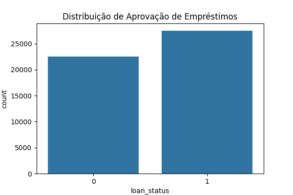
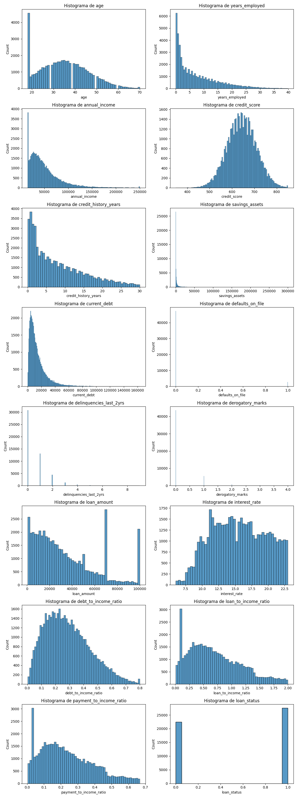
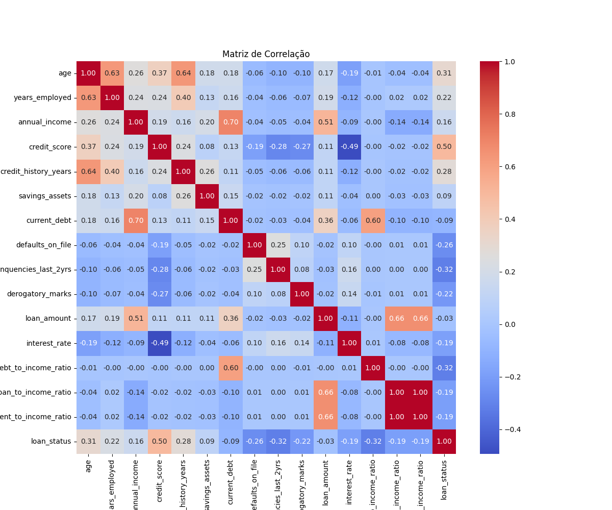
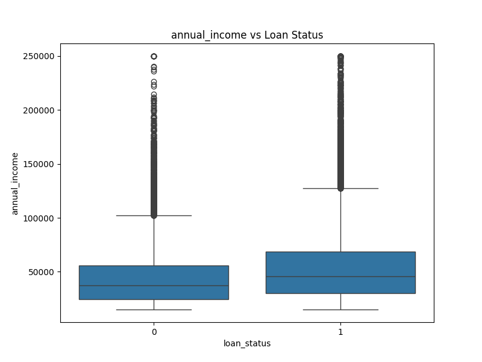
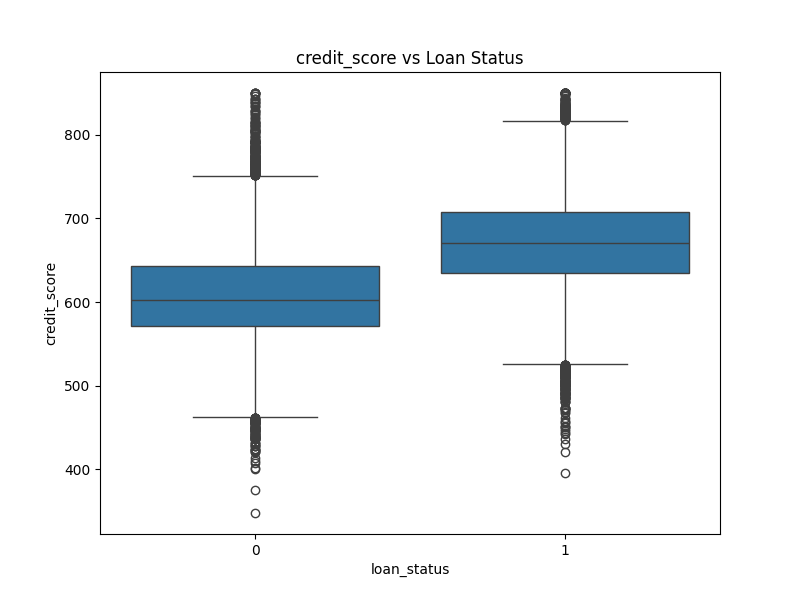
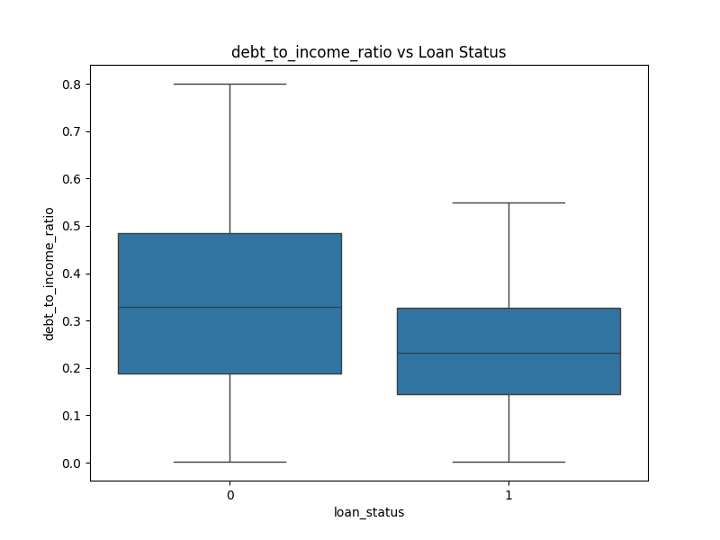

# Predição de Aprovação de Empréstimo

## 1. Contextualização do Projeto

### Objetivo
O objetivo deste projeto é desenvolver um modelo de machine learning capaz de prever a aprovação de empréstimos com base em dados históricos de clientes. O modelo deve auxiliar na tomada de decisão automática, identificando perfis de risco e aprovando candidatos qualificados.

### Dataset 
Encontrado no Kaggle em [Realistic Loan Approval Dataset](https://www.kaggle.com/datasets/parthpatel2130/realistic-loan-approval-dataset-us-and-canada).
O dataset contém 50.000 registros e 20 colunas, cobrindo dados demográficos, financeiros e de comportamento de crédito.

#### Dicionário de Dados
| Coluna | Descrição | Tipo |
| :--- | :--- | :--- |
| `customer_id` | Identificador único do cliente. | Texto (ID) |
| `age` | Idade do cliente. | Numérico |
| `occupation_status` | Situação empregatícia (Ex: Employed, Student). | Categórico |
| `years_employed` | Anos de emprego. | Numérico |
| `annual_income` | Renda anual. | Numérico |
| `credit_score` | Pontuação de crédito. | Numérico |
| `credit_history_years` | Tempo de histórico de crédito em anos. | Numérico |
| `savings_assets` | Valor em poupança/ativos. | Numérico |
| `current_debt` | Dívida atual. | Numérico |
| `defaults_on_file` | Histórico de inadimplência (0 ou 1). | Binário |
| `delinquencies_last_2yrs` | Delinquências nos últimos 2 anos. | Numérico |
| `derogatory_marks` | Marcas depreciativas no histórico. | Numérico |
| `product_type` | Tipo de produto (Credit Card, Personal Loan, etc). | Categórico |
| `loan_intent` | Intenção do empréstimo (Education, Medical, etc). | Categórico |
| `loan_amount` | Valor do empréstimo solicitado. | Numérico |
| `interest_rate` | Taxa de juros. | Numérico |
| `debt_to_income_ratio` | Razão Dívida/Renda. | Numérico |
| `loan_to_income_ratio` | Razão Empréstimo/Renda. | Numérico |
| `payment_to_income_ratio` | Razão Pagamento/Renda. | Numérico |
| `loan_status` | **Variável Alvo** (1 = Aprovado, 0 = Rejeitado). | Binário |

## 2. Metodologia e Implementação

### Pré-processamento
1.  **Limpeza**: Remoção de duplicatas e dados nulos.
2.  **Seleção de Features**: Remoção da coluna `customer_id` (irrelevante para predição).
3.  **Tratamento de Categóricos**: Uso de `OneHotEncoder` para variáveis como `occupation_status` e `loan_intent`.
4.  **Normalização**: Aplicação de `StandardScaler` para padronizar variáveis numéricas.
5.  **Divisão de Dados**:
    - Treino: 70%
    - Teste: 15%
    - Validação: 15%

### Modelos Avaliados
Foram treinados e comparados 9 algoritmos diferentes, incluindo Logistic Regression, Random Forest, SVM, KNN e XGBoost.

## 3. Análise Exploratória de Dados (EDA)

Realizamos uma análise gráfica para entender a distribuição dos dados e as correlações.

### Distribuição do Target
A variável alvo `loan_status` mostra um desequilíbrio moderado, mas suficiente para aprendizado.

### Histogramas das Variáveis Numéricas
Visualização da distribuição de todas as variáveis numéricas do dataset.

### Correlação
A matriz de correlação destaca variáveis fortemente correlacionadas com a aprovação.

### Relação com Variáveis Numéricas
Observamos como a renda, score de crédito e DTI influenciam a aprovação.

## 4. Resultados da Modelagem

Abaixo estão as métricas obtidas no conjunto de teste para os modelos treinados:

| Modelo | Accuracy | ROC-AUC | F1-Score |
| :--- | :--- | :--- | :--- |
| Logistic Regression | 0.8700 | 0.9477 | 0.8824 |
| Random Forest | 0.9148 | 0.9759 | 0.9231 |
| Gradient Boosting | 0.9255 | 0.9819 | 0.9333 |
| Gaussian Naive Bayes | 0.6443 | 0.9207 | 0.7555 |
| Multi-layer Perceptron | 0.9153 | 0.9760 | 0.9236 |
| KNeighbors | 0.8728 | 0.9381 | 0.8881 |
| SVC | 0.9147 | 0.9763 | 0.9228 |
| DecisionTree | 0.8747 | 0.8732 | 0.8864 |
| **XGBoost** | **0.9269** | **0.9836** | **0.9340** |

### Análise dos Objetivos
- **Accuracy (80-95%)**: A maioria dos modelos atingiu este critério. O XGBoost ficou em ~92.7%.
- **ROC-AUC (0.80-0.90)**: Os modelos superaram a expectativa, chegando a 0.98.
- **F1-Score (0.75-0.85)**: Os modelos também superaram esta métrica, com o XGBoost atingindo 0.93.

## 5. Conclusão

O modelo **XGBoost** foi selecionado como o melhor modelo e salvo em `resultados/modelo_final.pkl`. Ele apresentou o melhor equilíbrio entre todas as métricas, superando ligeiramente o Gradient Boosting e Random Forest.

